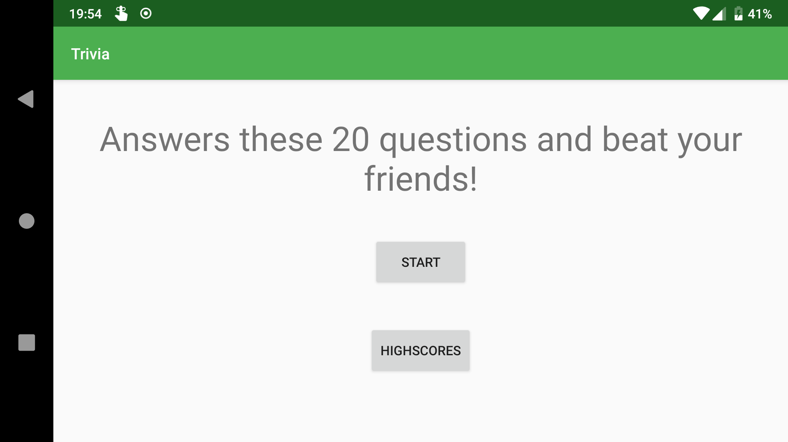
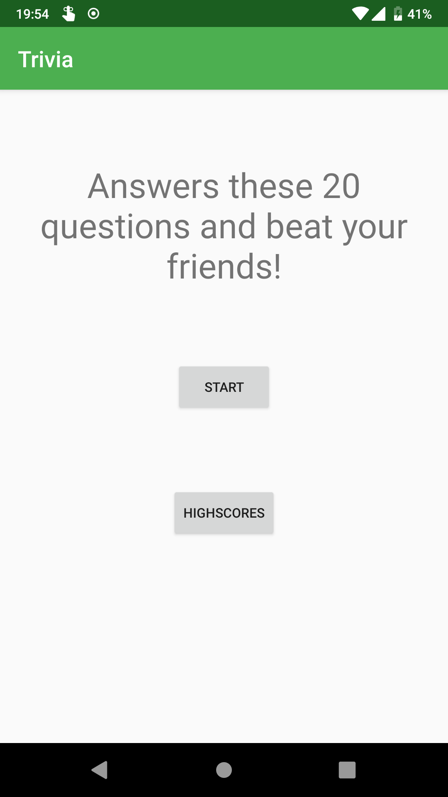
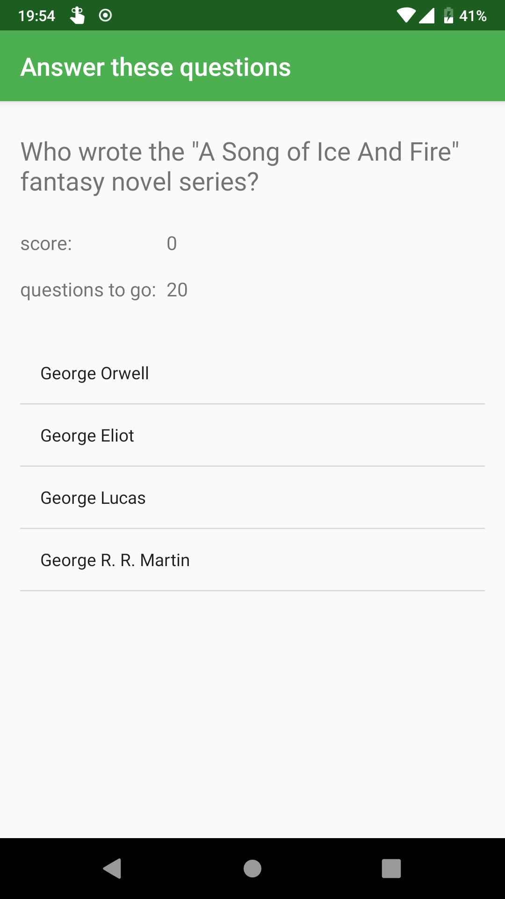
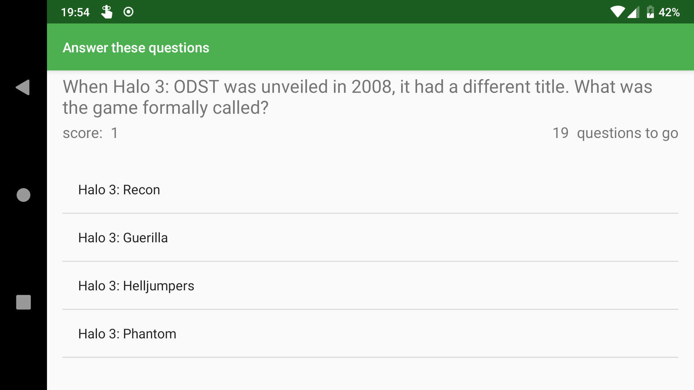
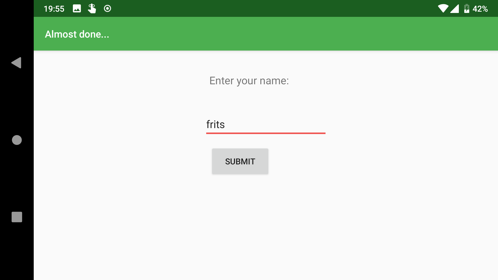
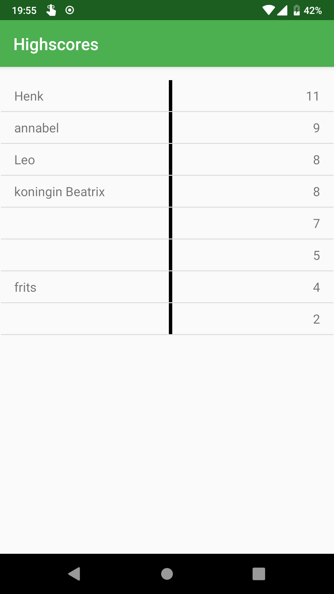
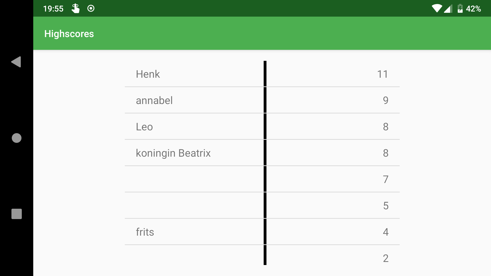

# Trivia

This app serves the user 20 multiple choice trivia questions and lets them submit their score and compare it with other players.

## Activities

### Main screen

Here the user can choose to play the game or just view the list of highscores.

### Gameplay

Once the game has started, the user must answer 20 questions. The player can see their score and see how many questions still have to be answered.

### Enter the score

The user must enter their name to submit it into the score list. No entry is also accepted, cause why not. The 'done' button on the user's keyboard performs the same function as the 'submit' button on the screen.

### View the highscore list

This shows all the scores ever submitted. The list is scrollable.

